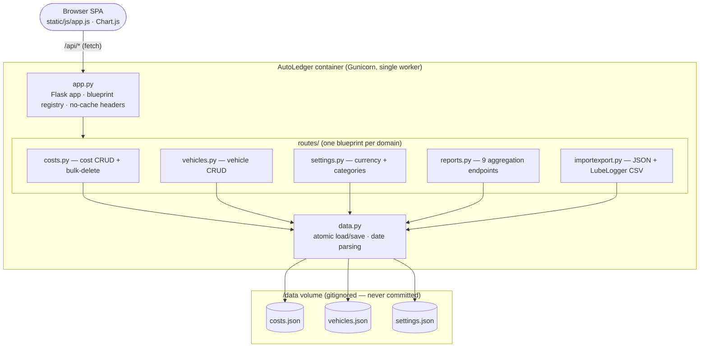
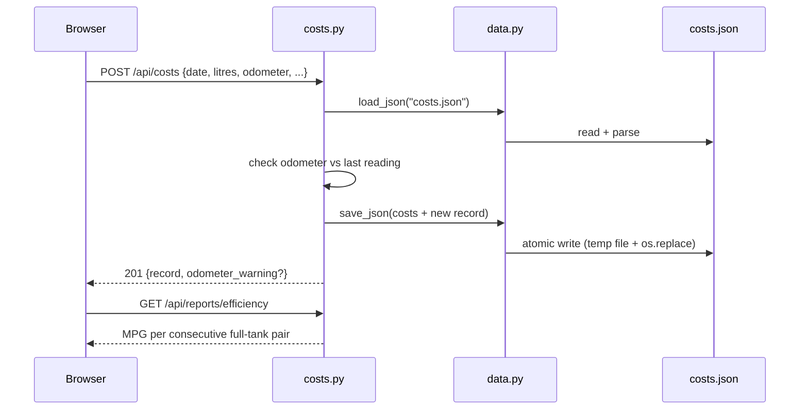

# AutoLedger — Developer Handover

> Canonical reference for any developer or future AI session picking up this
> project. Read before touching code. Update with every release.

**Current version:** 1.8.6
**Stack:** Flask + Python + flat JSON storage + Chart.js frontend
**Deployment:** Docker on Mac (dev) or Synology DS923+ NAS (prod)

---

## Architecture



The single Gunicorn worker is deliberate — it serialises writes to the flat
JSON files and prevents the read-modify-write races that multiple workers would
cause (see [ADR 0002](docs/adr/0002-single-gunicorn-worker.md)).

### Request flow — adding a fuel fill



---

## Philosophy

- **Simplicity over features.** Single-user home-lab tool. No auth, no multi-tenancy.
- **No silent failures.** Narrow `try/except` only. Errors surface explicitly.
- **Flat JSON storage** is intentional — easy to back up, inspect, diff. Migration
  path to SQLite: replace `routes/data.py` load/save helpers only.
- **Light mode default.** Dark mode is a user preference stored in `localStorage`.
- **Settings are exactly what you save.** No auto-merge of categories from cost
  records (that caused deleted categories to reappear silently).
- **DOM is the source of truth for UI state.** Do not use JS variables to mirror
  what the DOM already knows. The `_expandedRows` Set was eliminated in v1.8.5
  because it drifted out of sync with the DOM — the canonical lesson.

---

## Repository Structure

```
autoledger/
├── app.py                    # Flask entry; blueprints; favicon; no-cache headers
├── requirements.txt          # Pinned Python deps (Flask, Gunicorn, python-dateutil)
├── Dockerfile                # Single Gunicorn worker (prevents JSON write races)
├── docker-compose.yml        # Reads DATA_PATH from .env
├── .env                      # DATA_PATH=./data (Mac) or /volume1/... (Synology)
├── .dockerignore             # Excludes data/, .env, zips, docs from build context
├── CHANGELOG.md              # Version history
├── HANDOVER.md               # This file
├── Makefile                  # setup / run / test / lint / fmt / clean targets
├── docs/adr/                 # Architecture Decision Records (numbered)
│
├── routes/
│   ├── __init__.py           # Makes routes/ a Python package
│   ├── data.py               # Atomic load/save + shared parse_date_to_iso
│   ├── costs.py              # CRUD + bulk-delete + last-odometer
│   ├── vehicles.py           # Vehicle CRUD
│   ├── settings.py           # Currency + category list (persisted to settings.json)
│   ├── reports.py            # 9 report aggregation endpoints
│   └── importexport.py       # JSON export; AutoLedger JSON import; LubeLogger CSV import
│
└── static/
    ├── index.html            # SPA shell — no inline JS or CSS
    ├── favicon.svg           # SVG favicon served as /favicon.ico
    ├── css/styles.css        # All styles; light/dark via CSS custom properties
    └── js/app.js             # All client logic — fully commented (1800+ lines)
```

---

## Data Model

### Cost record (`/data/costs.json`)
```json
{
  "id":           "uuid4",
  "vehicle_id":   "uuid4",
  "date":         "YYYY-MM-DD",
  "category":     "Fuel",
  "amount":       42.50,
  "note":         "BP Example Forecourt",
  "source":       "manual | lubelogger | import",
  "litres":       48.12,
  "odometer":     54321.0,
  "is_full_tank": true,
  "unit_cost":    0.8831,
  "fuel_economy": 14.898
}
```
Fuel-specific fields only present on Fuel entries. `fuel_economy` is L/100mi.

### Vehicle (`/data/vehicles.json`)
```json
{
  "id": "uuid4", "name": "Insignia", "make": "Vauxhall",
  "model": "Insignia", "year": 2018, "colour": "Silver",
  "registration": "AB12 CDE", "notes": "Company car",
  "created_at": "ISO-8601"
}
```

### Settings (`/data/settings.json`)
```json
{ "currency_symbol": "£", "categories": ["Fuel", "Insurance", "Servicing & Repairs", "Road Tax"] }
```

---

## API Endpoints

| Method | Endpoint                          | Notes                                             |
|--------|-----------------------------------|---------------------------------------------------|
| GET    | `/api/costs`                      | `?vehicle_id=&sort=&order=`                       |
| POST   | `/api/costs`                      | Returns `odometer_warning` if reading goes back   |
| PUT    | `/api/costs/<id>`                 | Partial update                                    |
| DELETE | `/api/costs/<id>`                 | Idempotent                                        |
| POST   | `/api/costs/bulk-delete`          | `{vehicle_id, source}` — used by re-import        |
| GET    | `/api/costs/last-odometer`        | `?vehicle_id=` → `{odometer, date}`               |
| GET    | `/api/vehicles`                   |                                                   |
| POST   | `/api/vehicles`                   |                                                   |
| PUT    | `/api/vehicles/<id>`              |                                                   |
| DELETE | `/api/vehicles/<id>?cascade=true` | cascade=true also deletes all costs               |
| GET    | `/api/settings`                   |                                                   |
| POST   | `/api/settings`                   |                                                   |
| GET    | `/api/export/json`                | Full backup download                              |
| POST   | `/api/import/json`                | AutoLedger JSON (ID-deduped)                      |
| POST   | `/api/import/lubelogger`          | LubeLogger CSV (`vehicle_id` form field required) |
| GET    | `/api/reports/summary`            | KPIs                                              |
| GET    | `/api/reports/monthly`            | Monthly spend by category (zero-filled)           |
| GET    | `/api/reports/category`           | Total by category                                 |
| GET    | `/api/reports/efficiency`         | MPG/km/L per fill; returns record IDs             |
| GET    | `/api/reports/cumulative`         | Running total                                     |
| GET    | `/api/reports/costpermile`        | Monthly cost ÷ miles driven                       |
| GET    | `/api/reports/fillinterval`       | Days between fuel stops                           |
| GET    | `/api/reports/fuelvsother`        | Fuel vs non-fuel monthly                          |
| GET    | `/api/reports/annual`             | Year-by-year summary table                        |

All report endpoints accept `?vehicle_id=&months=` (months=0 = all time).

---

## LubeLogger Import

Confirmed CSV columns from a real LubeLogger export:

| LubeLogger     | AutoLedger field  |
|----------------|-------------------|
| `Date`         | `date` (DD/MM/YYYY → ISO) |
| `Odometer`     | `odometer`        |
| `FuelConsumed` | `litres`          |
| `Cost`         | `amount`          |
| `IsFillToFull` | `is_full_tank`    |
| `FuelEconomy`  | `fuel_economy`    |
| `Notes`        | `note`            |

**Critical:** Date format is DD/MM/YYYY. The `_DATE_FORMATS` list in `data.py`
tries `%d/%m/%Y` before `%m/%d/%Y`. Reversing this causes dates to sort wrong
and MPG calculations produce absurd results (negative miles, 400+ MPG).

---

## MPG Calculation

In `routes/reports.py → _compute_efficiency()`:

1. Filter to full-tank fills with both `litres` and `odometer`
2. Normalise dates to ISO-8601 then sort chronologically (CRITICAL)
3. For each consecutive pair: `MPG = miles / (litres / 4.54609)`
4. Sanity check: 10 ≤ MPG ≤ 100 (outside = bad odometer or missed fill)
5. Apply date filter AFTER computing (preserves correct previous-fill reference)
6. Return record IDs so frontend matches by ID, not fragile date+odometer

---

## Frontend Architecture

### Fuel Detail Panel (v1.8.6 — definitive)
Each fuel row contains a `<div class="fuel-detail-panel">` embedded inside its
note `<td>`. Showing/hiding is done by toggling CSS class `open`.

**CRITICAL — SCOPED IDs**
The same record appears in BOTH the dashboard (`recent-body`) and entries
(`entries-body`) tables. If both use `id="panel-{recordId}"`, then
`document.getElementById` finds the dashboard's panel first (DOM order), and
toggles that hidden one instead of the visible entries panel.

Fix: all panel/button IDs are prefixed with their table scope:
- Dashboard: `panel-recent-{id}`, `expand-recent-{id}`  
- Entries:   `panel-entries-{id}`, `expand-entries-{id}`

`buildRow(c, mpgMap, scope)` — scope is `'recent'` or `'entries'`
`toggleFuelDetail(id, scope)` — must receive the same scope

**State management:** `panel.classList.toggle('open')` is the sole mechanism.
No JS variable tracks open/closed state — the DOM is the source of truth.
`_expandedRows` Set was eliminated in v1.8.5 after it caused persistent sync bugs.

### Async Table Rendering
`renderRecentTable()` and `renderEntriesTable()` are both async because they
await `getMpgMap()`. The MPG map is cached in `_mpgMapCache` after the first
fetch — subsequent calls return instantly (still async, resolved immediately).
`_mpgMapCache` is set to `null` on every data change to force a refresh.

### Page Navigation
`showPage(name)` calls `renderEntriesTable()` when navigating to the entries
page, ensuring the table is always fresh and panel state is clean.

---

## Deployment

### Mac (development)
```bash
cd ~/Docker/autoledger
docker compose up --build   # rebuilds image; needed after Python changes
# App at http://localhost:5050
```

### Synology NAS (DS923+, DSM 7.x)
```
Host IP:  192.168.0.100
Port:     5050 → 5000
Data:     /volume1/docker/autoledger/data/
```
Edit `.env`: `DATA_PATH=/volume1/docker/autoledger/data`

### Static files
Flask serves static files with `Cache-Control: no-store` (set in `app.py`
`after_request` hook). This ensures browser always loads latest JS/CSS.
Cache-busting query strings (`?v=1.8.5`) are also appended in `index.html`.

---

## Version Bump Checklist

When releasing a new version, update ALL of:
1. `app.py` docstring version
2. `static/js/app.js` header comment version
3. `static/index.html` HTML comment + `sidebar-version` div + `?v=` params on CSS/JS
4. `CHANGELOG.md` — new section at top
5. `HANDOVER.md` — version number at top

---

## Known Limitations

- No authentication — keep behind VPN or Tailscale
- No pagination — all records loaded into memory (fine at <1000 records)
- Single currency per session — per-record currency not supported
- Odometer in miles only — km would need a `distance_unit` setting
- LubeLogger service/insurance split is keyword-based heuristic — imperfect
