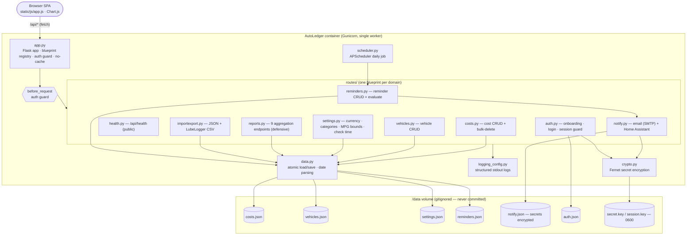
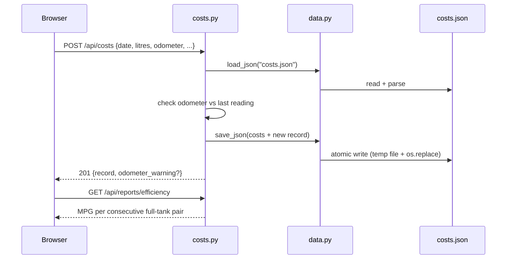

# AutoLedger — Developer Handover

> Canonical reference for any developer or future AI session picking up this
> project. Read before touching code. Update with every release.

**Current version:** 2.0.1
**Stack:** Flask + Python + flat JSON storage + Chart.js frontend; Argon2id auth,
Fernet at-rest secret encryption, APScheduler in-process reminder scheduler
**Deployment:** Docker on Mac (dev) or Synology DS923+ NAS (prod)

---

## Architecture



The single Gunicorn worker is deliberate — it serialises writes to the flat
JSON files and prevents the read-modify-write races that multiple workers would
cause (see [ADR 0002](docs/adr/0002-single-gunicorn-worker.md)). It also makes
the in-process reminder scheduler trivially correct: exactly one instance, no
double-fire (see [ADR 0007](docs/adr/0007-reminders-and-in-process-scheduler.md)).

### Request flow — adding a fuel fill



---

## Philosophy

- **Simplicity over features.** Single-user home-lab tool. One admin account
  (no multi-tenancy); see [Authentication](#authentication).
- **No silent failures.** Narrow `try/except` only. Errors surface explicitly.
- **Flat JSON storage** is intentional — easy to back up, inspect, diff. Migration
  path to SQLite: replace `routes/data.py` load/save helpers only.
- **Light mode default.** Dark mode is a user preference stored in `localStorage`.
- **Settings are exactly what you save.** No auto-merge of categories from cost
  records (that caused deleted categories to reappear silently).
- **DOM is the source of truth for UI state.** Do not use JS variables to mirror
  what the DOM already knows. The `_expandedRows` Set was eliminated in v1.8.5
  because it drifted out of sync with the DOM — the canonical lesson.

---

## Repository Structure

```
autoledger/
├── app.py                    # Flask entry; blueprints; auth guard; scheduler start; no-cache
├── version.py                # Single source of truth for the app version
├── requirements.txt          # Pinned deps (Flask, Gunicorn, dateutil, argon2-cffi, cryptography, APScheduler)
├── Dockerfile                # Single Gunicorn worker (prevents JSON write races) + HEALTHCHECK
├── docker-compose.yml        # Reads DATA_PATH from .env
├── .env                      # DATA_PATH=./data (Mac) or /volume1/... (Synology)
├── .dockerignore             # Excludes data/, .env, zips, docs from build context
├── CHANGELOG.md              # Version history
├── HANDOVER.md               # This file
├── Makefile                  # setup / run / test / lint / fmt / clean targets
├── docs/adr/                 # Architecture Decision Records (numbered)
│
├── routes/
│   ├── __init__.py           # Makes routes/ a Python package
│   ├── data.py               # Atomic load/save + shared parse_date_to_iso + save logging
│   ├── logging_config.py     # Structured key=value stdout logger (log_event)
│   ├── crypto.py             # Fernet encrypt/decrypt for at-rest secrets (secret.key)
│   ├── auth.py               # Onboarding, login/logout, session, /api/* access guard
│   ├── health.py             # GET /api/health (unauthenticated)
│   ├── costs.py              # CRUD + bulk-delete + last-odometer
│   ├── vehicles.py           # Vehicle CRUD
│   ├── settings.py           # Currency, categories, MPG bounds, reminder check time
│   ├── reports.py            # 9 report aggregation endpoints (defensive numeric coercion)
│   ├── importexport.py       # JSON export; AutoLedger JSON import; LubeLogger CSV import
│   ├── reminders.py          # Reminder CRUD + status evaluation + notify dispatch
│   ├── notify.py             # Email (SMTP) + Home Assistant channels; test endpoints
│   └── scheduler.py          # APScheduler daily reminder job (in-process)
│
├── tests/                    # pytest suite (run via `make test`) — 83 tests
│   ├── conftest.py           # Temp-dir DATA_DIR isolation + authenticated/anon clients
│   ├── test_dates.py         # parse_date_to_iso format precedence
│   ├── test_efficiency.py    # MPG/km-L maths + consecutive-fill engine
│   ├── test_importexport.py  # LubeLogger detection/mapping + JSON round-trip
│   ├── test_api.py           # Cost/vehicle/settings/reports endpoint behaviour
│   ├── test_auth.py          # Onboarding gate, login/logout, guard, no-secret-leak
│   ├── test_health.py        # Health endpoint (public, counts)
│   ├── test_notify.py        # Crypto round-trip + config masking + at-rest encryption
│   ├── test_reminders.py     # Date/mileage status, CRUD, recurrence advance
│   └── test_robustness.py    # Bad records don't 500 reports; import skips bad rows; MPG bounds
│
├── pyproject.toml            # pytest + ruff configuration
├── requirements-dev.txt      # Test/lint deps (pytest, ruff) on top of requirements.txt
│
└── static/
    ├── index.html            # SPA shell — no inline JS or CSS
    ├── favicon.svg           # SVG favicon served as /favicon.ico
    ├── css/styles.css        # All styles; light/dark via CSS custom properties
    └── js/app.js             # All client logic — fully commented (1800+ lines)
```

---

## Testing

A `pytest` suite lives in `tests/` and runs on **Python 3.12 inside Docker**
(`make test`) — the host Mac only has Python 3.9, on which the app's 3.10+
type-union annotations cannot import. See [ADR 0005](docs/adr/0005-testing-approach.md).

```bash
make test     # pytest in an ephemeral python:3.12-slim container (matches prod)
make lint     # ruff check
make fmt      # ruff format (opt-in — not run across existing aligned-style code)
```

`tests/conftest.py` points `DATA_DIR` at a throwaway temp directory *before* the
app is imported and wipes the JSON files between tests, so every test gets a
pristine store against the real storage code path — no mocking, no real `/data`.

Coverage focuses on the historically fragile logic: date-format precedence,
the MPG/efficiency engine (pairing, sanity bounds, period cutoff), LubeLogger
import, and endpoint validation. Writing it immediately surfaced a real bug —
`POST /api/costs` returned early in the odometer branch and skipped the
`is_full_tank` assignment, so **hand-entered fuel fills never produced an MPG**
(only LubeLogger imports, which set the flag themselves, did). Fixed by building
the full entry before a single persist; `test_reports_summary_end_to_end` guards
against regression.

---

## Data Model

### Cost record (`/data/costs.json`)
```json
{
  "id":           "uuid4",
  "vehicle_id":   "uuid4",
  "date":         "YYYY-MM-DD",
  "category":     "Fuel",
  "amount":       42.50,
  "note":         "BP Example Forecourt",
  "source":       "manual | lubelogger | import",
  "litres":       48.12,
  "odometer":     54321.0,
  "is_full_tank": true,
  "unit_cost":    0.8831,
  "fuel_economy": 14.898
}
```
Fuel-specific fields only present on Fuel entries. `fuel_economy` is L/100mi.

### Vehicle (`/data/vehicles.json`)
```json
{
  "id": "uuid4", "name": "Insignia", "make": "Vauxhall",
  "model": "Insignia", "year": 2018, "colour": "Silver",
  "registration": "AB12 CDE", "notes": "Company car",
  "created_at": "ISO-8601"
}
```

### Settings (`/data/settings.json`)
```json
{
  "currency_symbol": "£",
  "categories": ["Fuel", "Insurance", "Servicing & Repairs", "Road Tax"],
  "mpg_min": 10,
  "mpg_max": 100,
  "reminder_check_time": "08:00"
}
```

### Reminder (`/data/reminders.json`)
```json
{
  "id": "uuid4", "vehicle_id": "uuid4",
  "type": "MOT | Service | Tax | Insurance | Custom",
  "label": "MOT",
  "due_date": "YYYY-MM-DD | null",
  "due_mileage": 60000,
  "recur_months": 12, "recur_miles": 10000,
  "lead_days": 30, "lead_miles": 500,
  "notify": true, "last_notified": "YYYY-MM-DD | null",
  "created_at": "ISO-8601"
}
```
At least one of `due_date` / `due_mileage` is required. "Current mileage" is the
highest fuel odometer for the vehicle. Status = worst of date/mileage:
`ok` / `due` / `overdue`.

### Notification config (`/data/notify.json`)
```json
{
  "email": { "enabled": false, "host": "smtp.resend.com", "port": 587,
             "username": "resend", "password": "enc:v1:…",
             "from_addr": "…", "to_addr": "…" },
  "homeassistant": { "enabled": false, "base_url": "http://192.168.0.200:8123",
                     "token": "enc:v1:…", "notify_service": "" }
}
```
`password` and `token` are **Fernet-encrypted** (`enc:v1:` prefix). They are
never returned by `GET /api/notify/config` (only `*_set` booleans).

### Auth + keys (gitignored, never returned by any GET)
- `/data/auth.json` — `{ username, password_hash (argon2id), created_at }`
- `/data/secret.key` — Fernet key for secret encryption (`0600`)
- `/data/session.key` — Flask session-signing secret (`0600`)

---

## Authentication

Single admin account. First run forces onboarding (no account → `403
onboarding_required` on protected routes; the SPA shows the onboarding screen).
After onboarding, every `/api/*` route requires a session except the public
allow-list: `/api/health`, `/api/auth/status`, `/api/auth/login`,
`/api/auth/onboard`. There is **no password recovery** — store the credential
safely. Losing `secret.key` only loses the stored SMTP/HA secrets (re-enterable
in the UI), not the cost data. See [ADR 0006](docs/adr/0006-authentication-and-at-rest-secrets.md).

## Reminders & Notifications

Reminders evaluate live in the UI and via an in-process APScheduler job that runs
daily at `settings.reminder_check_time`. When a reminder is due/overdue the
scheduler pushes a Home Assistant sensor state per reminder
(`sensor.autoledger_<vehicle>_<type>`) and emails a digest (each channel
independently toggleable). `last_notified` caps external notifications at one per
reminder per day. The scheduler is disabled under tests via
`AUTOLEDGER_DISABLE_SCHEDULER=1`. See [ADR 0007](docs/adr/0007-reminders-and-in-process-scheduler.md).

---

## API Endpoints

All routes below require a session **except** `/api/health` and the
`/api/auth/{status,login,onboard}` endpoints.

| Method | Endpoint                          | Notes                                             |
|--------|-----------------------------------|---------------------------------------------------|
| GET    | `/api/health`                     | Public — `{status, version, vehicles, records}`   |
| GET    | `/api/auth/status`                | Public — `{onboarded, authenticated, username}`   |
| POST   | `/api/auth/onboard`               | First-run only — create admin (409 if exists)     |
| POST   | `/api/auth/login`                 | `{username, password}` → session                  |
| POST   | `/api/auth/logout`                | Clears session                                    |
| GET    | `/api/reminders`                  | `?vehicle_id=` → list with live status            |
| GET    | `/api/reminders/due`             | Due/overdue only (dashboard banner)               |
| POST   | `/api/reminders`                  | Create (needs date and/or mileage)                |
| PUT    | `/api/reminders/<id>`             | Partial update                                    |
| DELETE | `/api/reminders/<id>`             | Idempotent                                        |
| POST   | `/api/reminders/<id>/complete`    | Advance recurrence / clear                        |
| POST   | `/api/reminders/evaluate`         | Manual "check now" → notify                        |
| GET    | `/api/notify/config`              | Masked config (no secrets)                        |
| POST   | `/api/notify/config`              | Save (blank secret = keep existing)               |
| POST   | `/api/notify/test-email`          | Send a test email                                 |
| POST   | `/api/notify/test-ha`             | Push a test state to Home Assistant               |

| Method | Endpoint                          | Notes                                             |
|--------|-----------------------------------|---------------------------------------------------|
| GET    | `/api/costs`                      | `?vehicle_id=&sort=&order=`                       |
| POST   | `/api/costs`                      | Returns `odometer_warning` if reading goes back   |
| PUT    | `/api/costs/<id>`                 | Partial update                                    |
| DELETE | `/api/costs/<id>`                 | Idempotent                                        |
| POST   | `/api/costs/bulk-delete`          | `{vehicle_id, source}` — used by re-import        |
| GET    | `/api/costs/last-odometer`        | `?vehicle_id=` → `{odometer, date}`               |
| GET    | `/api/vehicles`                   |                                                   |
| POST   | `/api/vehicles`                   |                                                   |
| PUT    | `/api/vehicles/<id>`              |                                                   |
| DELETE | `/api/vehicles/<id>?cascade=true` | cascade=true also deletes all costs               |
| GET    | `/api/settings`                   |                                                   |
| POST   | `/api/settings`                   |                                                   |
| GET    | `/api/export/json`                | Full backup download                              |
| POST   | `/api/import/json`                | AutoLedger JSON (ID-deduped)                      |
| POST   | `/api/import/lubelogger`          | LubeLogger CSV (`vehicle_id` form field required) |
| GET    | `/api/reports/summary`            | KPIs                                              |
| GET    | `/api/reports/monthly`            | Monthly spend by category (zero-filled)           |
| GET    | `/api/reports/category`           | Total by category                                 |
| GET    | `/api/reports/efficiency`         | MPG/km/L per fill; returns record IDs             |
| GET    | `/api/reports/cumulative`         | Running total                                     |
| GET    | `/api/reports/costpermile`        | Monthly cost ÷ miles driven                       |
| GET    | `/api/reports/fillinterval`       | Days between fuel stops                           |
| GET    | `/api/reports/fuelvsother`        | Fuel vs non-fuel monthly                          |
| GET    | `/api/reports/annual`             | Year-by-year summary table                        |

All report endpoints accept `?vehicle_id=&months=` (months=0 = all time).

---

## LubeLogger Import

Confirmed CSV columns from a real LubeLogger export:

| LubeLogger     | AutoLedger field  |
|----------------|-------------------|
| `Date`         | `date` (DD/MM/YYYY → ISO) |
| `Odometer`     | `odometer`        |
| `FuelConsumed` | `litres`          |
| `Cost`         | `amount`          |
| `IsFillToFull` | `is_full_tank`    |
| `FuelEconomy`  | `fuel_economy`    |
| `Notes`        | `note`            |

**Critical:** Date format is DD/MM/YYYY. The `_DATE_FORMATS` list in `data.py`
tries `%d/%m/%Y` before `%m/%d/%Y`. Reversing this causes dates to sort wrong
and MPG calculations produce absurd results (negative miles, 400+ MPG).

---

## MPG Calculation

In `routes/reports.py → _compute_efficiency()`:

1. Filter to full-tank fills with both `litres` and `odometer`
2. Normalise dates to ISO-8601 then sort chronologically (CRITICAL)
3. For each consecutive pair: `MPG = miles / (litres / 4.54609)`
4. Sanity check: 10 ≤ MPG ≤ 100 (outside = bad odometer or missed fill)
5. Apply date filter AFTER computing (preserves correct previous-fill reference)
6. Return record IDs so frontend matches by ID, not fragile date+odometer

---

## Frontend Architecture

### Fuel Detail Panel (v1.8.6 — definitive)
Each fuel row contains a `<div class="fuel-detail-panel">` embedded inside its
note `<td>`. Showing/hiding is done by toggling CSS class `open`.

**CRITICAL — SCOPED IDs**
The same record appears in BOTH the dashboard (`recent-body`) and entries
(`entries-body`) tables. If both use `id="panel-{recordId}"`, then
`document.getElementById` finds the dashboard's panel first (DOM order), and
toggles that hidden one instead of the visible entries panel.

Fix: all panel/button IDs are prefixed with their table scope:
- Dashboard: `panel-recent-{id}`, `expand-recent-{id}`  
- Entries:   `panel-entries-{id}`, `expand-entries-{id}`

`buildRow(c, mpgMap, scope)` — scope is `'recent'` or `'entries'`
`toggleFuelDetail(id, scope)` — must receive the same scope

**State management:** `panel.classList.toggle('open')` is the sole mechanism.
No JS variable tracks open/closed state — the DOM is the source of truth.
`_expandedRows` Set was eliminated in v1.8.5 after it caused persistent sync bugs.

### Async Table Rendering
`renderRecentTable()` and `renderEntriesTable()` are both async because they
await `getMpgMap()`. The MPG map is cached in `_mpgMapCache` after the first
fetch — subsequent calls return instantly (still async, resolved immediately).
`_mpgMapCache` is set to `null` on every data change to force a refresh.

### Page Navigation
`showPage(name)` calls `renderEntriesTable()` when navigating to the entries
page, ensuring the table is always fresh and panel state is clean.

---

## Deployment

### Mac (development)
```bash
cd ~/Docker/autoledger
docker compose up --build   # rebuilds image; needed after Python changes
# App at http://localhost:5050
```

### Synology NAS (DS923+, DSM 7.x)
```
Host IP:  192.168.0.100
Port:     5050 → 5000
Data:     /volume1/docker/autoledger/data/
```
Edit `.env`: `DATA_PATH=/volume1/docker/autoledger/data`

### Static files
Flask serves static files with `Cache-Control: no-store` (set in `app.py`
`after_request` hook). This ensures browser always loads latest JS/CSS.
Cache-busting query strings (`?v=1.8.5`) are also appended in `index.html`.

---

## Version Bump Checklist

When releasing a new version, update ALL of:
1. `version.py` `__version__` (single source of truth — health + export read it)
2. `app.py` docstring version
3. `static/js/app.js` header comment version
4. `static/index.html` HTML comment + `sidebar-version` div + `?v=` params on CSS/JS
5. `static/css/styles.css` header comment version
6. `CHANGELOG.md` — new section at top
7. `HANDOVER.md` — version number at top

---

## Known Limitations

- **Single admin account, no password recovery.** Store the credential safely;
  there is no reset flow. (The encryption key for secrets is independent, so a
  future reset would not destroy data — see ADR 0006.)
- No pagination — all records loaded into memory (fine at <1000 records)
- Single currency per session — per-record currency not supported
- Odometer in miles only — km would need a `distance_unit` setting
- LubeLogger service/insurance split is keyword-based heuristic — imperfect
- Reminders use a daily in-process scheduler; if the app is ever made
  multi-worker (ADR 0002) the scheduler needs a single-instance guard (ADR 0007)
- Logs go to stdout only (no file rotation) — the container platform owns capture
